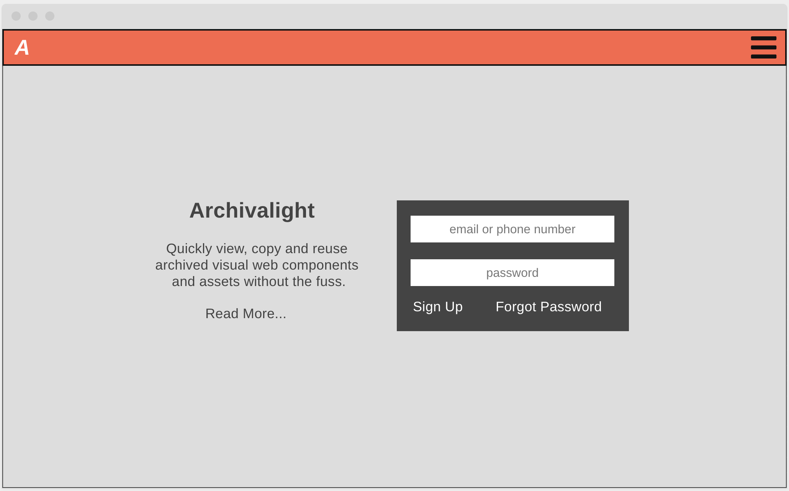
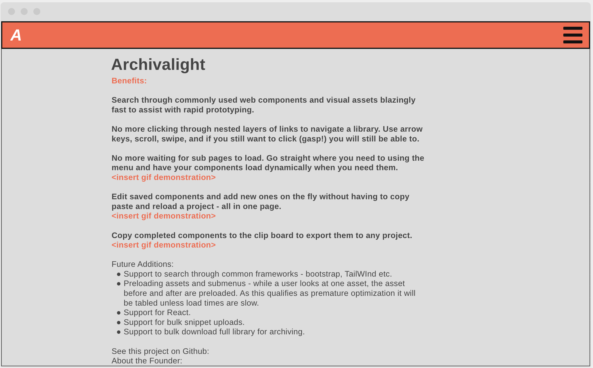
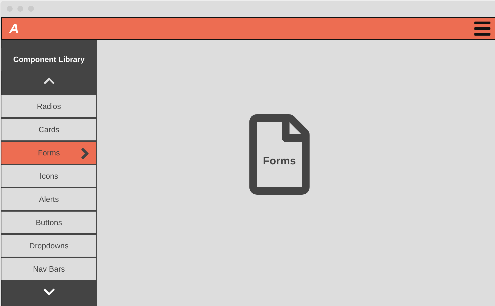
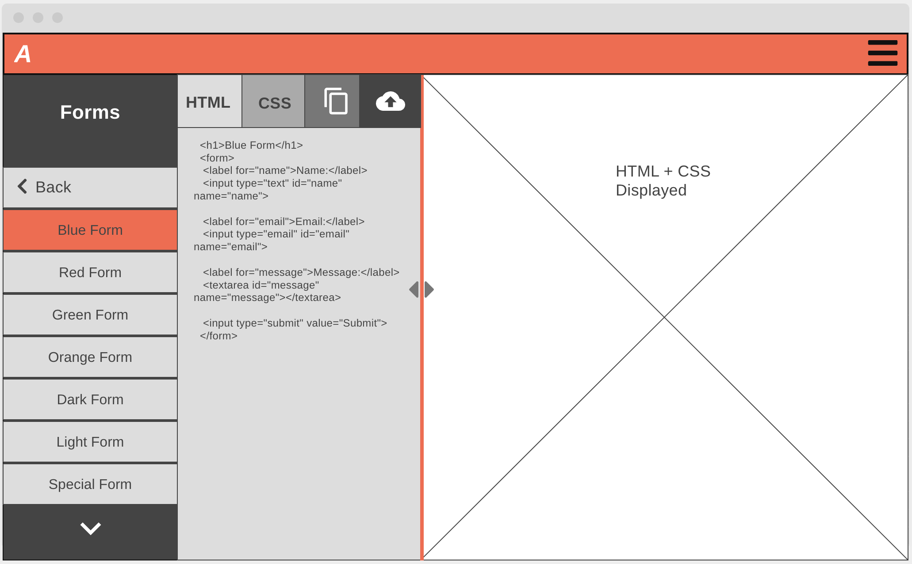
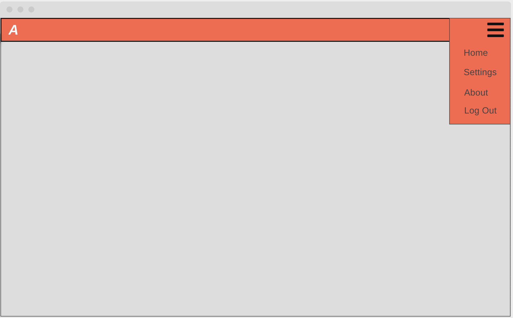
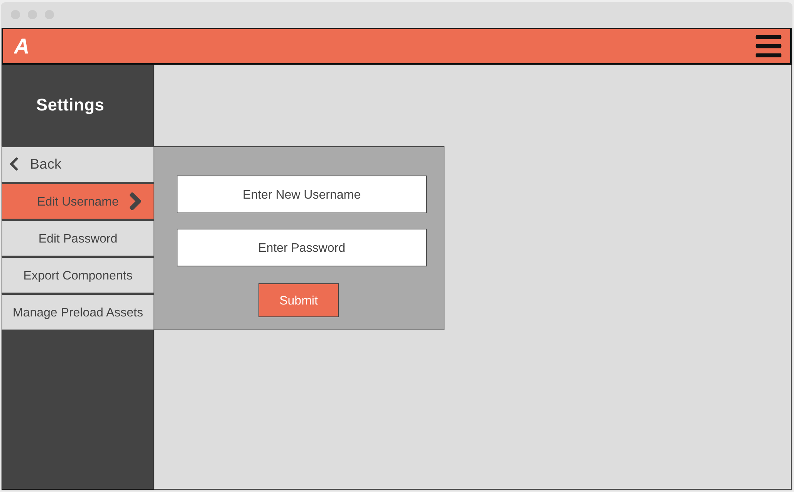

# Design Doc
Design doc written using this [guide](https://www.industrialempathy.com/posts/design-docs-at-google/).

## Context and Scope
As a working software engineer I'm often looking through libraries of components and manipulating code snippets to test before adding them to my code. It often means looking through a framework website consisting of several subpages, copying what I need to display that component and pasting it into a playground to test. If I don't save this snippet somewhere it often means looking it up again and going through an identical process. I wanted to create a program to make this less painful and time consuming. Meet Archivalight.

The scope of the Archivalight beta will solve the formentioned pain as simply as possible. It will be a multi page website that provides a component explorer with a built in playground for every component and allows the user to save their own code snippets and change them on the fly to test. It will be navigable by arrow keys on a keyboard in addition to clicking to make exploration of components much faster.
 

## Goals and non-goals
* Provide a full set of features as a minimum viable product
* Create a UI that's intuitive and does the job without getting in the way
* Don't fall into a pattern of preoptimization
* Limit scope to what's needed at first
 

### User Feature Dos
- A user should be able to explore components
- A user should be able to store components in a user account
- A user should be able to edit components and display them dynamically
- A user should be able to login
- A user should be able to change their username and password
- A user should be able to navigate the menu tree with arrow keys
- The ux should make the UI functions apparent
- The user should be able to be logged in in multiple tabs
- The ux should be consistent across browsers
 

### User Feature Dont's
- The user experience should not be slow
- The user shouldn't have to login more than once a day
- The user shouldn't focus on the interface as much as the content
 

## Design
The following are wireframes of the individual pages. They are general suggestions of the UI and not a 1:1 map of the style or funcitonality.

### Login
The login screen should be basic and give a tagline for the service allowing for login, forgot password, or new account creation.

 

## About
The about page should show off the product and sell benefits, not features. Users should realize how much time they can save making prototypes and indexing past work.

 

## Library View
- The library view is the top level view for exploring components. The menu to the left is multi tiered. Arrowing up or down will allow the user to highlight a menu option to select. Arrowing right will select that option and the menu will be replaced with the sub menu under that option. Arrowing left after this will let the user go back to the parent menu. In addition the user will be able to click through if they desire.
- Right of the menu is an icon representing the category of items they are selecting. This will at first be a set of default categories with a specific icon for custom. A future addition would allow users to add their own icons for custom categories.

 

## Item View
- The menu in the item view works the same as that of the library view.
- Right of the menu is the code editor. It will let a user edit the code and have it displayed dynamically in the window to the right. They can also save their work in the current component or save it as a new component.

 

## Menu Popout
- This is a standard menu that may be converted to icons at a future time. For now the minimum viable product will include a dropdown.

 

## Settings

- This is a user settings menu for things like account management and category management. The features will be defined by what's added to the application.

 

## APIS
- Authentication - Provider TBD.
 

## Degree of Constraint
- No features should be added on beyond what has been described until delivery of the site.
- Sharing, importing, exporting, and mobile are not in the scopeof the initial project.
 

## Cross-Cutting-Concerns
- Authentication will be provided by a 3rd party vendor.